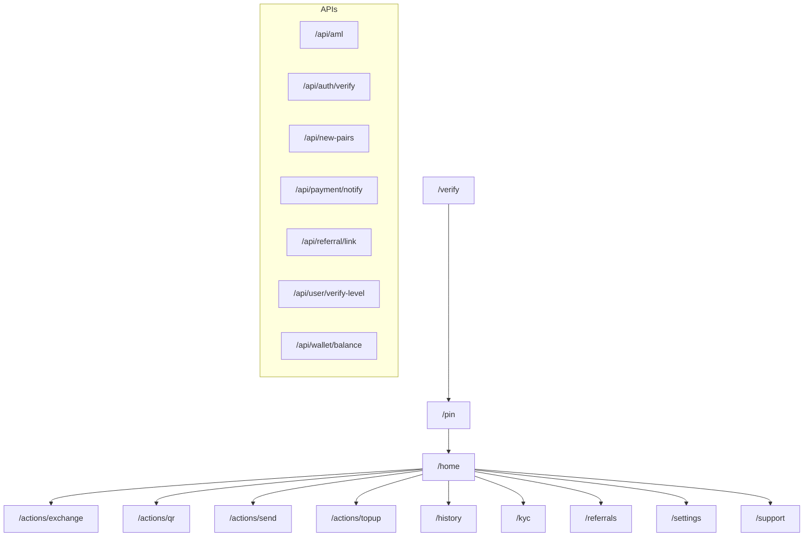

# CryptoBali — Архитектурная карта

Дата: 2025-09-10

## Флоу/дерево (Mermaid)


## Роуты (pages)
- ✅ `/`
- ✅ `/actions/exchange`
- ✅ `/actions/qr`
- ✅ `/actions/send`
- ✅ `/actions/topup`
- ✅ `/history`
- ✅ `/home`
- ✅ `/kyc`
- ✅ `/pin`
- ✅ `/referrals`
- ✅ `/settings`
- ✅ `/support`
- ✅ `/verify`


## API (app/api)
- ✅ `/api/aml`
- ✅ `/api/auth/verify`
- ✅ `/api/new-pairs`
- ✅ `/api/payment/notify`
- ✅ `/api/referral/link`
- ✅ `/api/user/verify-level`
- ✅ `/api/wallet/balance`


## Дерево файлов (срез)

```text
web
├─ .gitignore
├─ .vercel
│  ├─ README.txt
│  └─ project.json
├─ README.md
├─ app
│  ├─ (auth)
│  │  └─ pin
│  │     └─ page.tsx
│  ├─ (onboarding)
│  │  └─ verify
│  │     └─ page.tsx
│  ├─ actions
│  │  ├─ exchange
│  │  │  └─ page.tsx
│  │  ├─ qr
│  │  │  └─ page.tsx
│  │  ├─ send
│  │  │  └─ page.tsx
│  │  └─ topup
│  │     └─ page.tsx
│  ├─ api
│  │  ├─ aml
│  │  │  └─ route.ts
│  │  ├─ auth
│  │  │  └─ verify
│  │  ├─ new-pairs
│  │  │  └─ route.ts
│  │  ├─ payment
│  │  │  └─ notify
│  │  ├─ referral
│  │  │  └─ link
│  │  ├─ user
│  │  │  └─ verify-level
│  │  └─ wallet
│  │     └─ balance
│  ├─ error.tsx
│  ├─ globals.css
│  ├─ history
│  │  └─ page.tsx
│  ├─ home
│  │  └─ page.tsx
│  ├─ kyc
│  │  └─ page.tsx
│  ├─ layout.tsx
│  ├─ not-found.tsx
│  ├─ page.backup.txt
│  ├─ page.keep.txt
│  ├─ page.tsx
│  ├─ providers.tsx
│  ├─ referrals
│  │  └─ page.tsx
│  ├─ settings
│  │  └─ page.tsx
│  └─ support
│     └─ page.tsx
├─ components
│  ├─ providers
│  │  └─ TonConnectProvider.tsx
│  └─ wallet
│     ├─ Connect.tsx
│     ├─ JettonUtils.ts
│     ├─ QRScanner.tsx
│     ├─ RequestPayment.tsx
│     ├─ SendJettonForm.tsx
│     └─ SendTonForm.tsx
├─ docs
│  └─ ARCHITECTURE.md
├─ lib
│  ├─ aml
│  │  └─ providers
│  │     ├─ hapi.ts
│  │     ├─ tonapi.ts
│  │     └─ trm.ts
│  ├─ deeplink.ts
│  ├─ memdb.ts
│  └─ tg.ts
├─ next-env.d.ts
├─ next.config.js
├─ next.config.mjs
├─ package-lock.json
├─ package.json
├─ public
│  └─ tonconnect-manifest.json
├─ scripts
│  ├─ gen-arch.mjs
│  └─ scaffold.mjs
└─ tsconfig.json
```

> Файл сгенерирован автоматически: `scripts/gen-arch.mjs`.
